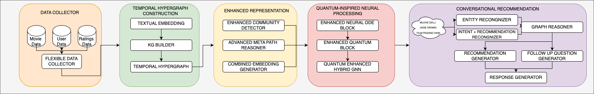

# QIRS: Quantum-Inspired Conversational Movie Recommender System

## 📌 Overview

QIRS (Quantum-Inspired Recommender System) is a novel conversational recommender system for Bollywood movies that synergistically integrates temporal hypergraph knowledge representations, neural ordinary differential equations, and quantum-inspired inference mechanisms. The system combines the power of structured knowledge graphs with continuous preference modeling and quantum computing concepts to provide personalized, diverse, and explainable movie recommendations through natural conversation.

This work establishes a new paradigm for conversational recommenders that effectively navigates the multidimensional space of user preferences while providing transparent, context-aware, and culturally nuanced recommendations.

## 🌟 Key Features

- **Quantum-Enhanced Recommendation Engine**: Uses principles like superposition and entanglement for better uncertainty handling and recommendation diversity
- **Temporal Hypergraph Knowledge Representation**: Models complex many-to-many relationships between movies, actors, directors, genres, and users
- **Neural ODE-Based Preference Modeling**: Captures continuous evolution of user preferences over time
- **Advanced Meta-Path Reasoning**: Provides explainable recommendations through knowledge graph paths
- **Community Detection**: Identifies clusters of related entities for better recommendations
- **Multilingual Conversation Support**: Handles conversations in English and Hinglish
- **Contextual Understanding**: Maintains conversation context for personalized recommendations

## 🏗️ System Architecture

The system consists of five main components as shown in the architecture diagram:

1. **Data Collector**: Flexible component for collecting and processing movie, user, and ratings data
2. **Temporal Hypergraph Construction**: Creates a rich knowledge graph with textual embeddings
3. **Enhanced Representation**: Detects communities and generates meta-paths for reasoning
4. **Quantum-Inspired Neural Processing**: Combines Neural ODE and Quantum blocks for advanced inference
5. **Conversational Recommendation**: Handles entity recognition, intent understanding, and natural language response generation

## 📊 Community Structure

The system employs spectral community detection to identify clusters of related entities in the knowledge graph. As shown in the visualization, the Bollywood movie domain naturally organizes into distinct communities (274 detected), often centered around genres, directors, or time periods. This community structure helps the recommender system identify patterns and make better suggestions.

The second visualization shows a focused view of the "Drama" community, highlighting how movies, actors, and directors in this genre are interconnected. These community insights power both the recommendation engine and the explanation generation.

## 🔬 Methodology

### Temporal Hypergraph

Unlike traditional knowledge graphs that use binary relations, our hypergraph allows many-to-many relationships through hyperedges. For example, a movie's production team can be represented as a single hyperedge connecting the movie, director, cinematographer, and music director:
